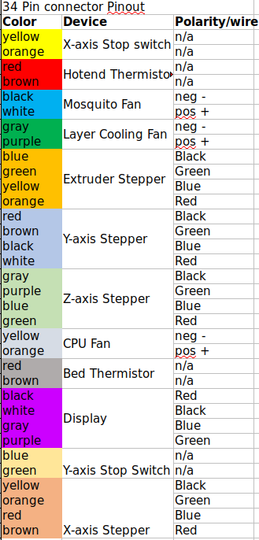

# BOM
## Components
| Part                                               | Qty | Cost    | Source                 |
|----------------------------------------------------|-----|---------|------------------------|
| 100x Spring Loaded T-Nuts 2020 M4/M5               | 2   | $25.90  | Zyltec                 |
| MGN12 Linear Rail - 1000mm - One Carriage          | 2   | $103.90 | Zyltec                 |
| MGN12 Linear Rail - 500mm - One Carriage           | 1   | $34.95  | Zyltec                 |
| Extrusions                                         | 1   | $154.39 | Openbuilds             |
| Duet Wifi                                          | 1   | $169.90 | Printed Solid          |
| PanelDue 7i                                        | 1   | $104.90 | Printed Solid          |
| Bondtech BMG                                       | 1   | $80.00  | Printed Solid          |
| Mosquito Mount                                     | 1   | $11.99  | Printed Solid          |
| Mosquito Hotend                                    | 1   | $144.80 | Printed Solid          |
| Slice Thermistor                                   | 1   | $39.99  | Printed Solid          |
| Slice 50W heater                                   | 1   | $18.80  | Printed Solid          |
| LDO .9 Stepper                                     | 3   | $45.00  | Printed Solid          |
| Nema 17 5:1 geared stepper                         | 1   | $39.87  | E3D Online             |
| F623zz Bearings                                    | 20  | $12.00  | e-bay                  |
| 2GT Timing pulley 20Tooth 5mm Bore                 | 2   | $2.00   | e-bay                  |
| 2GT Timing pulley 20tooth 8mm Bore                 | 1   | $2.00   | e-bay                  |
| 60T 1/2 GT2 pulley                                 | 1   | $13.00  | e-bay                  |
| 6202-2RS 1/2 ID bearing                            | 4   | $11.00  | thebigbearingstore.com |
| Micro switch endstop                               | 2   | $2.00   | Openbuilds             |
| Aluminum tube 3"x16"x.125" (61ARDT3125)            | 2   | $24.68  | Midweststeelsupply.com |
| Aluminum Tool Plate 3/8" x 15" x 20.5" (ALI38)     | 1   | $50.64  | Midweststeelsupply.com |
| Aluminum tool plate 3/8" x 9" x 20.5" (ALI38)      | 1   | $34.32  | Midweststeelsupply.com |
| 6061 Aluminum Square Bar 1/2" x 19" (61ASB12)      | 1   | $7.95   | Midweststeelsupply.com |
| 303 Stainless Bearing Shaft(303SSBSQ12) 1/2 x 20.5"| 2   | $16.00  | Midweststeelsupply.com |
| Full hardened Stainless steel belt 400mm x 1920mm  | 1   | $265-$370 | Belttechnologies.com   |
| **** Belt cost varies depending on Quantity ordered, group buys recommended  ****           |
| Buildtak sheet 405mm x 2000mm (3 week lead time)   | 1   | $290.00 | Buildtak.com           |
| Meanwell LRS350-24 powersupply                     | 1   | $30.00  | Jameco.com #2219823    |
| Silicone Bed heater 200x400 24v(ebay item #143206149832)| 1   | $55.00  | e-bay                  |
| Rubber feet                                        | 1   | $10.00  | e-bay                  |
| 1/2" x 19" aluminum sqaure bar                     | 1   | $7.95   | Midweststeelsupply.com |
| Noctua 40mm fans                                   | 3   | $45.00  | Amazon                 |
| Roller drive belt A6R51M125060                     | 1   | $6.00   | SDP/SI                 |
| 5 meters of GT2 Belt                               | 1   | $50.00  | SDP/SI                 |
| 24v Blower Fans                                    | 2   | $18.00  | Tinymachines.com       |
| stepper heat sink                                  | 1   | $5.00   | Amazon part #A-0047    |
| Power Connector/switch                             | 1   | $3.00   | ebay item#152765834186 |
| Bulk Harware order (nuts, bolt, etc)               | 1   | $202.73 | McMaster Carr          |
| 3/8-in Push Connect x 1/4-in MIP Male Fitting      | 1   | $3.78   | Lowes.com #835028      |
| 3/8-in Push Connect x 1/4-in MIP dia 90-Degree 	   | 1   | $4.18	 | Lowes.com #835045      |
| 3/8-in x 25-ft Polyethylene Tubing                 | 1   | $6.18   | Lowes.com #814305      |
|Buck converter (part # MP1584EN)                    | 1	 | $8.00	 | Amazon.com             |

## Extrusions
| Size           | Length | Qty |
|----------------|--------|-----|
| 4080 C-Channel | 914mm  | 2   |
| 2040 V-slot    | 520mm  | 3   |
| 2040 V-slot    | 700mm  | 2   |
| 2040 V-slot    | 460mm  | 1   |
| 2040 V-slot    | 453mm  | 1   |
| 2020 V-slot    | 315mm  | 2   |

## Bulk Hardware
| Item                            | Qty | Source        | Part #                  | 
|---------------------------------|-----|---------------|-------------------------| 
| M2 x 12mm bolt                  | 8   | McMaster-Carr | 92095A455               | 
| M2 Nut                          | 2   | McMaster-Carr | 91828A111               | 
| M2 Heatset                      | 6   | McMaster-Carr | 94459A120               | 
| M3 Heatset                      | 48  | McMaster-Carr | 94180A331               | 
| M3 Washer                       | 18  | McMaster-Carr | 93475A210               | 
| M3 Star washer                  | 4   | McMaster-Carr | 95060A320               | 
| M3 Nut                          | 6   | McMaster-Carr | 91828A211               | 
| M3 x 8mm bolt                   | 46  | McMaster-Carr | 92095A181               | 
| M3 x 10mm bolt                  | 14  | McMaster-Carr | 92095A182               | 
| M3 x 12mm bolt                  | 10  | McMaster-Carr | 92095A183               | 
| M3 x 16mm bolt                  | 28  | McMaster-Carr | 92095A184               | 
| M3 x 18mm bolt                  | 2   | McMaster-Carr | 92095A472               | 
| M3 x 25mm bolt                  | 14  | McMaster-Carr | 92095A186               | 
| M3 x 30mm bolt                  | 1   | McMaster-Carr | 92095A187               | 
| M3 x 35mm bolt                  | 4   | McMaster-Carr | 92095A201               | 
| M3 x 45mm bolt                  | 2   | McMaster-Carr | 92095A474               | 
| M4 x 8mm bolt                   | 4   | McMaster-Carr | 92095A189               | 
| M5 Square nut                   | 4   | McMaster-Carr | 90225A101               | 
| M5 T-nuts                       | 118 | Zyltec.com    | HW-M5-SPRNG-T-NUT-100PK | 
| M5 high temp washers            | 10  | McMaster-Carr | 93785A214               | 
| M5 x 15mm high temp/nylon washer| 10  |               |                         | 
| M5 x 8mm Button Bolt            | 104 | McMaster-Carr | 92095A207               | 
| M5 x 16mm Bolt                  | 23  | McMaster-Carr | 91292A126               | 
| M5 x 18mm Button Bolt           | 10  | McMaster-Carr | 92095A481               | 
| M5 x 30mm Bolt                  | 18  | McMaster-Carr | 91292A192               | 
| #2 x3/8in thread cutting screws | 2   |               |                         | 
| JST connectors                  | 6   | ebay          |                         | 
| Shaft Collar                    | 7   | McMaster-Carr | 9946K15                 | 
| M3 x8mm Knurled screw           | 2   | McMaster-Carr | 92545A111               | 

## Wire Harness
| Item                            | Qty | Source        | Part #                  | 
|---------------------------------|-----|---------------|-------------------------| 
| 34 Pin Male IDC connector       | 1   | TME.com       | AWHP-34P                | 
| 34 Pin Female IDC Connector     | 1   | Digikey.com   | 3M157228-ND             | 
| 4 position Molex Plug           | 1   | Digikey.com   | WM1018-ND               | 
| 4 position Molex receptical     | 1   | Digikey.com   | WM3701-ND               | 
| Molex Male pin                  | 4   | Digikey.com   | WM2500-ND               | 
| Molex female pin                | 4   | Digikey.com   | WM2501-ND               | 
| 20AWG 2 conductor blk/red       | 1   | Digikey.com   | CN180BR-25-ND           | 
| 26AWG 34 cond multi color ribbon| 1   | Digikey.com   | 3M157870-25-ND          | 

## 34 pin connector pinout

