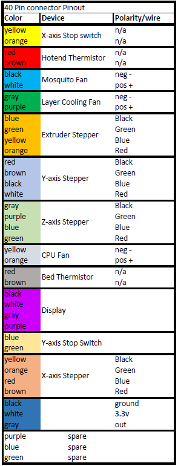

# BOM
## Components
| Part                                               | Qty | Cost    | Source                 |
|----------------------------------------------------|-----|---------|------------------------|
| 100x Spring Loaded T-Nuts 2020 M4/M5               | 2   | $25.90  | Zyltec                 |
| LDO MGN12H Linear Rail - 400mm - Single Carriage   | 3   | $120.00 | Printed Solid          |
| Extrusions                                         | 1   | $115.00 | Openbuilds             |
| Duet Wifi                                          | 1   | $169.90 | Printed Solid          |
| Duet Filament Monitor Rotating Magnet Version      | 1   | $52.95  | Printed Solid          |
| PanelDue 5i                                        | 1   | $89.90  | Printed Solid          |
| Bondtech BMG                                       | 1   | $80.00  | Printed Solid          |
| E3Dv6 hotend & nozzle (hand filed edge)            | 1   | $85.00  | Printed Solid          |
| LDO .9 Stepper LDO-42STH40-1684MAC                 | 2   | $32.00  | Printed Solid          |
| LDO .9 slim stepper LDO-42STH25-1404MAC            | 1   | $15.00  | Printed Solid          |
| LDO 5:1 geared stepper                             | 1   | $39.87  | Printed Solid          |
| LDO 2GT 16T Idler with 3mm Bore                    | 8   | $48.00  | Printed Solid          |
| Balitensen Toothless GT2 Idler Pulley 16T 3mm Bore | 2   | $7.90   | Amazon                 |
| 2GT Timing pulley 20Tooth 5mm Bore                 | 2   | $2.00   | e-bay                  |
| 2GT Timing pulley 20tooth 8mm Bore                 | 1   | $2.00   | e-bay                  |
| 6202-2RS 1/2 ID bearing                            | 3   | $9.00   | thebigbearingstore.com |
| Micro switch endstop                               | 2   | $2.00   | Openbuilds             |
| Aluminum tube 3" x 9.5"x.125" (61ARDT3125)         | 2   | $16.77  | Midweststeelsupply.com |
| Aluminum Tool Plate 1/4" x 4" x 15.75" (ALI38)     | 1   | $16.39  | Midweststeelsupply.com |
| Aluminum tool plate 1/4" x 6" x 15.75" (ALI38)     | 1   | $24.82  | Midweststeelsupply.com |
| 6061 Aluminum Square Bar 1/2" x 14.25" (61ASB12)   | 1   | $7.95   | Midweststeelsupply.com |
| 303 Stainless Bearing Shaft 1/2" x 15.75"(303SSBSQ12)| 2   | $14.00  | Midweststeelsupply.com |
| Full hardened Stainless steel belt 240mm x 1085mm  | 1   | $265-370 | Belttechnologies.com  |
| **** Belt cost varies depending on Quantity ordered, group buys recommended  ****           |
| Buildtak sheet 250mm x 1185mm (3 week lead time)   | 1   | $175.00 | Buildtak.com           |
| Meanwell LRS350-24 powersupply                     | 1   | $30.00  | Jameco.com #2219823    |
| Silicone Bed heater (ebay item #143351332434)      | 1   | $34.00  | e-bay                  |
| SUNON 40mm fans                                    | 5   | $52.00  | Printed Solid          |
| Buck converter (part # MP1584EN)				        	 | 1   | $8.00   | Amazon.com             |
| 8mm to 12mm shaft coupler                          | 1   | $10.25  | E-bay                  |
| 4 meters of GT2 Belt                               | 1   | $40.00  | Printed Solid          |
| BerdAir  Max 24V with eswitch kit                  | 1   | $48.50  | themakerhive.com       |
| stepper heat sink                                  | 1   | $5.00   | Amazon part #A-0047    |
| Power Connector/switch                             | 1   | $3.00   | ebay item#152765834186 |
| Bulk Harware order (nuts, bolt, etc)               | 1   | $202.73 | McMaster Carr          |
| 3/8-in Push Connect x 1/4-in NPT Male Fitting      | 2   | $15.06  | McMaster-Carr #5523K19 |
| 3/8-in x 25-ft Polyethylene Tubing                 | 1   | $6.18   | Lowes.com #814305      |

## Extrusions
| Size           | Length | Qty |
|----------------|--------|-----|
| 4080 C-Channel | 500mm  | 2   |
| 2040 V-slot    | 400mm  | 4   |
| 2040 V-slot    | 336mm  | 1   |
| 2040 V-slot    | 370mm  | 1   |
| 2040 V-slot    | 160mm  | 2   |
| 2040 V-slot    | 387mm  | 2   |
| 2020 V-slot    | 190mm  | 2   |

## Bulk Hardware
| Item                            | Qty | Source        | Part #                  | 
|---------------------------------|-----|---------------|-------------------------| 
| M2.5 x 12mm bolt                | 2   | McMaster-Carr | 92095A461               | 
| M2.5 Nut                        | 2   | McMaster-Carr | 91828A113               |
| M3 Heatset                      | 55  | McMaster-Carr | 94180A331               | 
| M3 Washer                       | 4   | McMaster-Carr | 93475A210               | 
| M3 Nut                          | 6   | McMaster-Carr | 91828A211               | 
| M3 x 8mm bolt                   | 60  | McMaster-Carr | 92095A181               | 
| M3 x 10mm bolt                  | 14  | McMaster-Carr | 92095A182               | 
| M3 x 12mm bolt                  | 10  | McMaster-Carr | 92095A183               | 
| M3 x 16mm bolt                  | 28  | McMaster-Carr | 92095A184               | 
| M3 x 18mm bolt                  | 2   | McMaster-Carr | 92095A472               | 
| M3 x 25mm bolt                  | 14  | McMaster-Carr | 92095A186               | 
| M3 x 30mm bolt                  | 1   | McMaster-Carr | 92095A187               | 
| M3 x 35mm bolt                  | 4   | McMaster-Carr | 92095A201               |
| M3 x 40mm bolt                  | 3   | McMaster-Carr | 92095A203               |
| M3 x 45mm bolt                  | 2   | McMaster-Carr | 92095A474               | 
| M4 x 8mm bolt                   | 8   | McMaster-Carr | 92095A189               | 
| M5 Square nut                   | 4   | McMaster-Carr | 90225A101               | 
| M5 T-nuts                       | 164 | Zyltec.com    | HW-M5-SPRNG-T-NUT-100PK | 
| M5 high temp washers            | 8   | McMaster-Carr | 93785A214               | 
| M5 x 15mm high temp/nylon washer| 8   |               |                         | 
| M5 x 8mm Button Bolt            | 156 | McMaster-Carr | 92095A207               | 
| M5 x 16mm Bolt                  | 21  | McMaster-Carr | 91292A126               | 
| M5 x 18mm Button Bolt           | 8   | McMaster-Carr | 92095A481               | 
| M5 x 30mm Bolt                  | 12  | McMaster-Carr | 91292A192               | 
| #2 x3/8in thread cutting screws | 2   |               |                         | 
| JST connectors                  | 6   | ebay          |                         | 
| Shaft Collar                    | 6   | McMaster-Carr | 9946K15                 |
| Stacked wave spring 5mm shaft   | 4   | McMaster-Carr | 1561T732                | 

## Wire Harness
| Item                            | Qty | Source        | Part #                  | 
|---------------------------------|-----|---------------|-------------------------| 
| 40 Pin Male IDC connector       | 1   | Digikey.com   | OR973-ND                | 
| 40 Pin Female IDC Connector     | 1   | Digikey.com   | OR923-ND                | 
| 4 position Molex Plug           | 2   | Digikey.com   | WM1018-ND               | 
| 4 position Molex receptical     | 2   | Digikey.com   | WM3701-ND               | 
| Molex Male pin                  | 4   | Digikey.com   | WM2500-ND               | 
| Molex female pin                | 4   | Digikey.com   | WM2501-ND               | 
| 20AWG 2 conductor blk/red       | 1   | Digikey.com   | CN180BR-25-ND           | 
| 26AWG 40 cond multi color ribbon| 1   | Digikey.com   | 3M157900-25-ND          | 

## Hotend Quick disconnect Bread Board
| Item                            | QTY | Source        | Part #                  |
|---------------------------------|-----|---------------|-------------------------|
| Molex MicroFit 3.0 6 Pos Header | 1   | Digikey.com   | WM4037-ND               |
| Molex Microfit 3.0 2 Pos header | 3   | Digikey.com   | WM1922-ND               |
| Molex Microfit 3.0 6 Pos Recpt  | 1   | Digikey.com   | WM1785-ND               |
| Molex Microfit 3.0 conn socket  | 25  | Digikey.com   | WM1125CT-ND             |
| Adafruit Jumper wire 22awg      | 1   | Digikey.com   | 1528-1743-ND            |
| Gikfun Breadboard GK1009        | 1   | Amazon.com    | GK1009                  |

## 40 pin connector pinout

